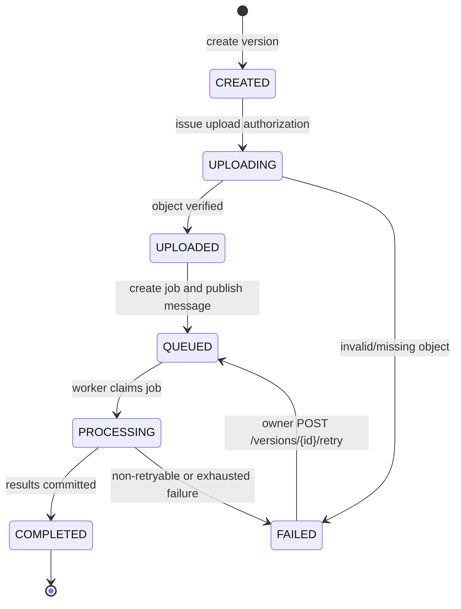
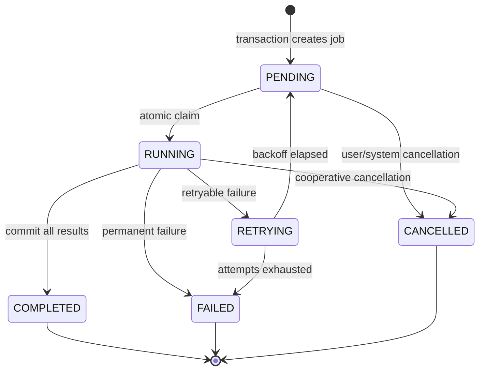
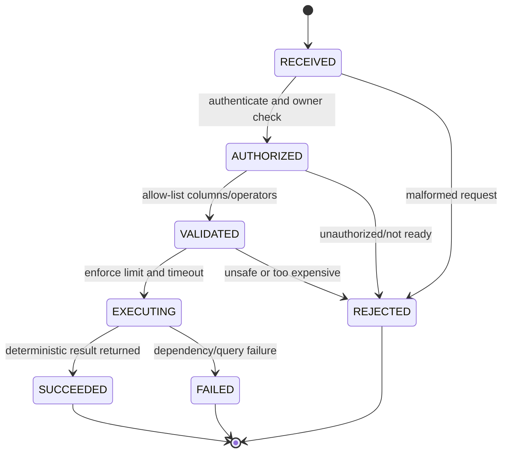

# DataForge Lifecycle Diagrams

## Dataset version lifecycle



Only the API/storage service may perform upload transitions. Only the worker
may transition `QUEUED` to `PROCESSING` and terminal processing states.
Invalid transitions return `invalid_state_transition` and do not mutate data.

An authenticated owner is the only actor allowed to initiate an explicit
version retry. The retry command requires `Idempotency-Key`. The previous
failed processing job remains an immutable `FAILED` audit record; the API
creates a new job and moves the version from `FAILED` to `QUEUED`. Repeating
the same idempotency key returns the same retry result. Concurrent retry
requests are collapsed by the active-job uniqueness constraint, so only one
new job is created.

## Processing job lifecycle



The message is acknowledged only after `COMPLETED`, `FAILED`, or
`CANCELLED` is durably recorded. A redelivered message rechecks the durable
job state and exits without creating duplicate results.

## Upload lifecycle

```mermaid
sequenceDiagram
    participant C as Client
    participant A as FastAPI
    participant S as S3/MinIO
    participant Q as RabbitMQ
    participant W as Worker
    participant DB as PostgreSQL

    C->>A: POST /versions/{id}/upload
    A->>DB: validate owner and version state
    A-->>C: presigned URL + object key
    C->>S: upload bytes directly
    C->>A: POST /versions/{id}/upload-complete
    A->>S: HEAD object and validate metadata
    A->>DB: UPLOADED -> QUEUED + create job
    A->>Q: publish idempotent job message
    A-->>C: 202 job_id
    W->>Q: consume message
    W->>DB: claim job; QUEUED -> PROCESSING
    W->>S: stream/chunk file
    W->>DB: persist profile/results + COMPLETED
    W->>Q: acknowledge message
```

The effective `X-Request-ID` is returned by the API, written to API logs, and
copied into the RabbitMQ message so the worker can use the same value in its
logs. If the client omits it, the API generates it.

## Analytical query lifecycle



Every query is recorded in `query_history`, including rejected and failed
requests. The query endpoint does not accept raw SQL.
